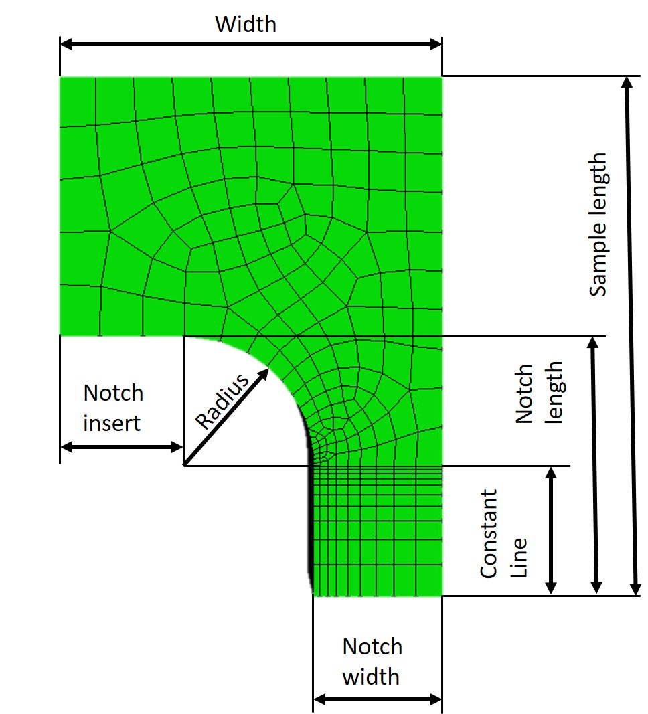

# Code for “Inverse parameter determination for metal foils in multifunctional composites”

Please cite the Paper if you use the code **https://doi.org/10.1016/j.matdes.2023.111711**

The code was tested on the CentOS Linux version using Abaqus 2019 .HF6. All of the Code was written in Python 2.

This Code allows the implementation of a complex, layered sample and evaluation in the commercial Abaqus software.

*Define_and_Run_Models.py*
<ul>
<li>Here your Geometrical and Simulational Parameters have to be defined. </li>
<li>You can choose between a Strain controlled and Force Controlled simulation and related Strain and Force amplitude.</li>
</ul>

Graphical representation of the geometrical parameters used in the simulation:

The Folder “Codes” includes the following files:

*Analyse_sample.py:*
<ul>
	<li>Allows the creation of field output at defined time points.</li>
	<li>Shows how different paths can be extracted from a model.</li>
</ul>

*Boundary_conditions.py:*
<ul>
	<li>Allows the implementation of periodic boundary conditions of the sample. Can implement both force and strain-controlled conditions. </li>
	<li>Periodic boundary conditions are implemented in a way to run effectively in Abaqus (see https://doi.org/10.1016/j.matdes.2023.111711 for details)</li>
	<li>It implements a serial connector to the model to deal with machine stiffness in an experiment.</li>
</ul>

*geometry_functions.py:*
<ul>
	<li>Implements the sample geometry, including all substrate/foil sections.</li>
</ul>

*material_model.py:*
<ul>
	<li>Here your material model can be defined. Currently, published (rounded) model parameters extracted from the paper (https://doi.org/10.1016/j.matdes.2023.111711) are implemented.</li>
	<li>Allows to implement orthotropic material parameters and checks if they are valid input parameters</li>
</ul>

*meshing.py:*
<ul>
	<li>Generates a mesh for the sample, including parameters to define the seeds for foils and substrated differently.</li>
</ul>

*run_simulation.py:*
<ul>
	<li>Calls all the files correctly to generate the model and the data extraction.</li>
</ul>

*step_definition.py:*
<ul>
	<li>Defines the step and history output and allows the creation of time points to guarantee data analysis always at specific points (e.g. max and min amplitude)</li>
</ul>

**µm UNIT System used:**

LENGTH            µm

FORCE             µN

MASS              kg

TIME              s

STRESS            MPa

ENERGY            pJ

DENSITY           kg/µm^3 = 10^18*kg/m^3

**Codes by Claus O. W. Trost**

Published under a Creative Commons license:
https://creativecommons.org/licenses/by-nc-nd/4.0/
